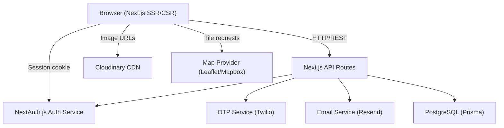

# Design Document: UK Realty Website

## Overview

UK Realty is a modern real estate web application targeting property buyers, renters, and investors in Bangalore, India. The platform is built around a monochrome design system and focuses on trust, lead generation, and a smooth browsing experience across all device sizes.

The application is a server-rendered or statically generated frontend (Next.js recommended) backed by a REST API layer. It supports anonymous browsing, user authentication, property search and filtering, interactive map views, saved properties, OTP-based phone verification with a 1% discount incentive, and a floor plan viewer.

### Technology Stack

- **Frontend**: Next.js 14 (App Router) with TypeScript
- **Styling**: Tailwind CSS with a custom monochrome design token set
- **Map**: Leaflet.js (open-source, no API key required) or Mapbox GL JS
- **State Management**: Zustand (lightweight, suitable for filter state, saved properties, auth state)
- **Backend / API**: Next.js API Routes (or a separate Node.js/Express service)
- **Database**: PostgreSQL via Prisma ORM
- **Authentication**: NextAuth.js (session-based, JWT strategy)
- **OTP / SMS**: Twilio SMS API
- **Email**: Resend (transactional email for password reset)
- **Image Storage**: Cloudinary (property images, floor plans, builder logos)
- **Search Autocomplete**: Algolia InstantSearch or a lightweight in-house prefix-search endpoint
- **Property-Based Testing**: fast-check (TypeScript-native PBT library)
- **Unit Testing**: Vitest + React Testing Library

---

## Architecture

The system follows a layered architecture with clear separation between the presentation layer, API layer, and data layer.



### Request Flow

1. User navigates to a page — Next.js SSR fetches initial data server-side
2. Client-side interactions (filters, saves, auth) hit `/api/*` routes
3. API routes validate input, apply business logic, and query the database via Prisma
4. Auth state is managed by NextAuth.js session cookies
5. OTP and email operations are delegated to external services (Twilio, Resend)

### Deployment

- Vercel (frontend + API routes) or a containerised Node.js deployment
- Managed PostgreSQL (Supabase, Railway, or AWS RDS)
- Cloudinary for media

---

## Components and Interfaces

### Page Structure

```
/                          → Homepage
/listings                  → Listings page (grid/list + map toggle)
/listings/[id]             → Property detail page
/contact                   → Contact page
/auth                      → Authentication page (login + register tabs)
/auth/forgot-password      → Password reset request page
/auth/reset-password       → Password reset form (token in query param)
/account                   → User account / profile page
/saved                     → Saved properties page
/builders/[slug]           → (optional) Builder-specific listing page
```

### UI Component Hierarchy

```
Layout
├── Header
│   ├── Logo
│   ├── NavLinks (desktop)
│   ├── AuthControls (login link / user name + logout)
│   ├── SavedPropertiesLink
│   └── HamburgerMenu (mobile)
│       └── MobileNavDrawer
├── Page Content
└── Footer
    ├── ContactDetails
    ├── QuickLinks
    └── SocialLinks

HomePage
├── HeroSection
│   └── SearchBar (with autocomplete)
├── FeaturedListings
│   └── ListingCard[]
├── BuilderSection
│   └── BuilderCard[]
├── ServicesSection
└── TestimonialsSection

ListingsPage
├── SearchBar
├── FilterPanel (desktop sidebar / mobile bottom sheet)
│   ├── PropertyTypeFilter
│   ├── PriceRangeFilter
│   ├── BedroomsFilter
│   ├── BathroomsFilter
│   ├── LocationFilter
│   └── BuilderFilter
├── ActiveFilterIndicators
├── ViewToggle (Grid | List | Map)
├── ListingGrid / ListingList
│   └── ListingCard[]
└── MapView (Leaflet map + PropertyPin[])
    └── PropertyPopupCard

PropertyDetailPage
├── ImageGallery
├── PropertyInfo (title, price, address, type, beds, baths)
├── PhoneDiscountBadge (if eligible)
├── Description
├── AmenitiesSection
├── FloorPlansSection
│   ├── FloorPlanThumbnail[]
│   └── LightboxModal
├── MapEmbed
├── EnquiryForm
├── AgentContactCard
│   ├── WhatsAppCTA
│   └── CallNowButton
└── StickyContactBar (mobile only)
    ├── WhatsAppCTA
    └── CallNowButton

AuthPage
├── LoginForm
└── RegisterForm

AccountPage
├── ProfileDetails
├── PhoneVerificationSection
│   ├── PhoneInput
│   └── OTPInput
└── SavedPropertiesLink

SavedPropertiesPage
└── ListingCard[] (or empty state)
```

### Key API Interfaces

```typescript
// Listings
GET  /api/listings              → ListingListResponse
GET  /api/listings/:id          → ListingDetailResponse
GET  /api/listings/search       → ListingListResponse (query: q, type, minPrice, maxPrice, beds, baths, location, builder, page)

// Builders
GET  /api/builders              → BuilderListResponse

// Auth (NextAuth handles /api/auth/*)
POST /api/auth/register         → { user: UserPublic }
POST /api/auth/forgot-password  → { message: string }
POST /api/auth/reset-password   → { message: string }

// OTP
POST /api/otp/send              → { message: string }
POST /api/otp/verify            → { verified: boolean }

// Saved Properties
GET  /api/saved                 → SavedListingListResponse
POST /api/saved/:listingId      → { saved: boolean }
DELETE /api/saved/:listingId    → { saved: boolean }

// Contact / Enquiry
POST /api/contact               → { message: string }
POST /api/enquiry/:listingId    → { message: string }
```

---

## Data Models

### Prisma Schema (abbreviated)

```prisma
model User {
  id              String    @id @default(cuid())
  name            String
  email           String    @unique
  passwordHash    String
  phone           String?
  phoneVerified   Boolean   @default(false)
  createdAt       DateTime  @default(now())
  updatedAt       DateTime  @updatedAt
  savedListings   SavedListing[]
  passwordResets  PasswordReset[]
  otpRecords      OtpRecord[]
}

model OtpRecord {
  id          String   @id @default(cuid())
  userId      String
  phone       String
  otpHash     String   // hashed OTP
  expiresAt   DateTime
  used        Boolean  @default(false)
  createdAt   DateTime @default(now())
  user        User     @relation(fields: [userId], references: [id])
}

model PasswordReset {
  id          String   @id @default(cuid())
  userId      String
  tokenHash   String   @unique  // hashed token
  expiresAt   DateTime
  used        Boolean  @default(false)
  createdAt   DateTime @default(now())
  user        User     @relation(fields: [userId], references: [id])
}

model Builder {
  id        String    @id @default(cuid())
  name      String    @unique
  slug      String    @unique
  logoUrl   String?
  listings  Listing[]
}

model Listing {
  id            String    @id @default(cuid())
  title         String
  description   String
  price         Int       // in INR, whole units
  propertyType  PropertyType
  bedrooms      Int?
  bathrooms     Int?
  address       String
  area          String    // locality / neighbourhood
  city          String    @default("Bangalore")
  lat           Float?
  lng           Float?
  images        String[]  // Cloudinary URLs
  amenities     String[]
  agentPhone    String
  agentWhatsApp String
  builderId     String?
  builder       Builder?  @relation(fields: [builderId], references: [id])
  floorPlans    FloorPlan[]
  savedBy       SavedListing[]
  available     Boolean   @default(true)
  featured      Boolean   @default(false)
  createdAt     DateTime  @default(now())
  updatedAt     DateTime  @updatedAt
}

model FloorPlan {
  id        String  @id @default(cuid())
  listingId String
  imageUrl  String
  order     Int     @default(0)
  listing   Listing @relation(fields: [listingId], references: [id])
}

model SavedListing {
  id        String   @id @default(cuid())
  userId    String
  listingId String
  savedAt   DateTime @default(now())
  user      User     @relation(fields: [userId], references: [id])
  listing   Listing  @relation(fields: [listingId], references: [id])

  @@unique([userId, listingId])
}

enum PropertyType {
  APARTMENT
  VILLA
  PLOT
  COMMERCIAL
}
```

### TypeScript Types (Frontend)

```typescript
interface Listing {
  id: string;
  title: string;
  description: string;
  price: number;
  discountedPrice?: number;   // populated when user has verified phone
  propertyType: 'APARTMENT' | 'VILLA' | 'PLOT' | 'COMMERCIAL';
  bedrooms?: number;
  bathrooms?: number;
  address: string;
  area: string;
  city: string;
  lat?: number;
  lng?: number;
  images: string[];
  amenities: string[];
  agentPhone: string;
  agentWhatsApp: string;
  builder?: Builder;
  floorPlans: FloorPlan[];
  available: boolean;
  featured: boolean;
  isSaved: boolean;           // resolved per-request for auth users
}

interface Builder {
  id: string;
  name: string;
  slug: string;
  logoUrl?: string;
}

interface FloorPlan {
  id: string;
  imageUrl: string;
  order: number;
}

interface FilterState {
  query: string;
  propertyType: string[];
  minPrice: number | null;
  maxPrice: number | null;
  bedrooms: number | null;
  bathrooms: number | null;
  location: string;
  builder: string;
  page: number;
}

interface User {
  id: string;
  name: string;
  email: string;
  phone?: string;
  phoneVerified: boolean;
}
```

### Phone Discount Calculation

```typescript
// Applied server-side when building listing responses for verified users
function applyPhoneDiscount(price: number): number {
  return Math.round(price * 0.99);
}
```

### Session-Based Save (Guest Users)

Guest saves are stored in a browser `sessionStorage` key `uk_realty_saved` as an array of listing IDs. On login, the client sends these IDs to `POST /api/saved/merge` which upserts them into the user's `SavedListing` records and the client clears `sessionStorage`.

### Filter Persistence

Active filters are serialised into URL query parameters (e.g. `/listings?type=APARTMENT&minPrice=5000000&beds=2`). This ensures filters survive navigation to a detail page and back via the browser back button, and are shareable via URL.

---

## Correctness Properties

*A property is a characteristic or behavior that should hold true across all valid executions of a system — essentially, a formal statement about what the system should do. Properties serve as the bridge between human-readable specifications and machine-verifiable correctness guarantees.*

### Property 1: Listing cards contain all required fields

*For any* listing in the database, the rendered listing card must include a non-empty image URL, title, price, location, property type, and (where applicable) bedroom and bathroom counts.

**Validates: Requirements 1.2**

---

### Property 2: Property detail page contains all required fields

*For any* listing, the rendered property detail page must include a non-empty image gallery, description, price, address, amenities list, and agent contact details.

**Validates: Requirements 1.4**

---

### Property 3: Filter correctness — all results satisfy active filters

*For any* combination of filter criteria (property type, price range, bedrooms, bathrooms, location, builder) and any listing dataset, every listing returned by the filtered query must satisfy all active filter criteria simultaneously. This applies to both the grid/list view and the map pin view.

**Validates: Requirements 2.2, 3.5, 8.4**

---

### Property 4: Filter clear is a round-trip

*For any* filter state applied to a listing dataset, clearing all filters must restore the result set to the complete unfiltered listing set.

**Validates: Requirements 2.3**

---

### Property 5: Active filters produce visible indicators

*For any* non-empty filter state, the listings page must render at least one active filter indicator badge corresponding to each applied filter dimension.

**Validates: Requirements 2.4**

---

### Property 6: Filter state is serialised into URL parameters

*For any* filter state, the URL query string must contain a parameter for each active filter, and parsing that URL must reconstruct an equivalent filter state.

**Validates: Requirements 2.5, 8.5**

---

### Property 7: Map pins match visible listings

*For any* listing dataset (filtered or unfiltered), the number of map pin markers rendered must equal the number of listings in the current result set.

**Validates: Requirements 3.2**

---

### Property 8: Contact form rejects incomplete submissions

*For any* contact form submission where one or more required fields (name, email, phone, subject, message) are empty or blank, the form must not be submitted and must display an inline validation error for each missing field.

**Validates: Requirements 4.4**

---

### Property 9: Contact form rejects invalid email format

*For any* string that does not conform to a valid email address format (e.g. missing @, missing domain), the contact form must display an inline error on the email field and must not submit.

**Validates: Requirements 4.5**

---

### Property 10: Enquiry form is pre-filled with listing title

*For any* listing, the property-specific enquiry form rendered on the Property_Detail_Page must have its subject or message field pre-populated with the listing's title.

**Validates: Requirements 4.6**

---

### Property 11: Contact link hrefs are correctly formatted

*For any* listing, the WhatsApp CTA button's href must be a valid `wa.me/{agentWhatsApp}` URL containing a URL-encoded message that references the property title and URL. The Call Now button's href must be `tel:{agentPhone}`.

**Validates: Requirements 4.8, 4.9**

---

### Property 12: Hero search navigates with query parameter

*For any* non-empty search query submitted from the hero search bar, the resulting navigation URL must be `/listings` with a `q` query parameter equal to the submitted search term.

**Validates: Requirements 6.2**

---

### Property 13: Builder click navigates with builder filter

*For any* builder in the Builder_Section, clicking that builder must navigate to `/listings` with a `builder` query parameter set to that builder's identifier.

**Validates: Requirements 6.7, 8.3**

---

### Property 14: Autocomplete triggers only at 3+ characters

*For any* search input string of length less than 3, no autocomplete suggestions must be displayed. *For any* search input string of length 3 or more, the autocomplete component must attempt to fetch and display matching suggestions.

**Validates: Requirements 7.2**

---

### Property 15: Search results match the search term

*For any* search term and listing dataset, every listing returned by the search must contain the search term (case-insensitive) in at least one of: title, description, or area/location fields.

**Validates: Requirements 7.3**

---

### Property 16: Registration creates a usable account (round-trip)

*For any* valid registration input (unique email, name, password ≥ 8 chars, matching confirmation), submitting the registration form must create a User_Account such that subsequently submitting the login form with the same email and password succeeds and returns an authenticated session.

**Validates: Requirements 9.3, 9.8**

---

### Property 17: Passwords are stored as hashes, not plaintext

*For any* registered user, the value stored in the `passwordHash` field of the User_Store must not equal the plaintext password provided during registration.

**Validates: Requirements 9.4**

---

### Property 18: Duplicate email registration is rejected

*For any* email address already associated with an existing User_Account, attempting to register a new account with that email must fail with an inline error and must not create a duplicate account.

**Validates: Requirements 9.5**

---

### Property 19: Password validation rejects short or mismatched passwords

*For any* password string shorter than 8 characters, or *for any* pair of password and confirmation strings that are not identical, the registration form and the password reset form must both reject the submission with an inline validation error.

**Validates: Requirements 9.6, 9.7, 11.7, 11.8**

---

### Property 20: Login failure returns a generic error (no email enumeration)

*For any* login attempt with an email not in the User_Store, or *for any* login attempt with a correct email but incorrect password, the Auth_Service must return the same generic "invalid credentials" error message, revealing no information about whether the email exists.

**Validates: Requirements 9.9, 9.10**

---

### Property 21: Logout invalidates the session

*For any* authenticated session, after the user logs out, any subsequent request using that session token must be treated as unauthenticated.

**Validates: Requirements 9.11**

---

### Property 22: Phone number validation rejects non-international formats

*For any* string that does not conform to a valid international phone number format (E.164), the OTP send endpoint must reject the request with an inline validation error and must not send an SMS.

**Validates: Requirements 10.2**

---

### Property 23: Correct OTP within expiry verifies the phone (round-trip)

*For any* authenticated user with a valid phone number, submitting the correct OTP within 10 minutes of issuance must result in `phoneVerified = true` in the User_Store.

**Validates: Requirements 10.4**

---

### Property 24: Incorrect OTP is rejected

*For any* OTP value that does not match the stored hash for the current OTP record, the verification endpoint must return an error and must not set `phoneVerified = true`.

**Validates: Requirements 10.5**

---

### Property 25: Expired OTP is rejected

*For any* OTP record whose `expiresAt` timestamp is in the past, submitting that OTP must return an expiry error and must not verify the phone number.

**Validates: Requirements 10.6**

---

### Property 26: Requesting a new OTP invalidates the previous one

*For any* user with an existing OTP record, requesting a new OTP must result in the previous OTP record being marked as used or deleted, such that submitting the old OTP code after the new one is issued must fail.

**Validates: Requirements 10.7**

---

### Property 27: Phone discount is calculated as price × 0.99 rounded to nearest integer

*For any* listed price (positive integer in INR), the discounted price displayed to a verified user must equal `Math.round(price * 0.99)`.

**Validates: Requirements 10.9, 10.11**

---

### Property 28: Unverified users see no discount

*For any* listing viewed by a guest user or an authenticated user without a verified phone number, the displayed price must equal the original listed price with no discount applied and no discounted price shown.

**Validates: Requirements 10.10**

---

### Property 29: Password reset token is stored as a hash

*For any* password reset token generated by the Password_Reset_Service, the value stored in the User_Store must not equal the plaintext token.

**Validates: Requirements 11.10**

---

### Property 30: Unknown email on password reset returns same response as known email

*For any* email address submitted to the password reset request endpoint, whether or not it exists in the User_Store, the HTTP response body and status code must be identical.

**Validates: Requirements 11.4**

---

### Property 31: Password reset round-trip

*For any* registered user, requesting a password reset, following the reset link with a valid unexpired token, and submitting a valid new password must result in the user being able to log in with the new password and not with the old password.

**Validates: Requirements 11.6**

---

### Property 32: Expired or used reset token is rejected

*For any* Password_Reset_Token whose `expiresAt` is in the past or whose `used` flag is true, attempting to use that token to reset a password must return an error and must not update the password.

**Validates: Requirements 11.9**

---

### Property 33: Save icon state reflects saved status

*For any* listing and any user (authenticated or guest), the save icon rendered for that listing must be in the filled state if and only if the listing is in the user's saved set (User_Store or Save_Session respectively).

**Validates: Requirements 12.1, 12.2**

---

### Property 34: Save is a round-trip for authenticated users

*For any* authenticated user and any listing, clicking the save icon on an unsaved listing must add it to the user's Saved_Properties such that querying the Saved_Properties_Page returns that listing.

**Validates: Requirements 12.3, 12.8**

---

### Property 35: Unsave removes the listing

*For any* authenticated user and any saved listing, clicking the save icon on that listing must remove it from the user's Saved_Properties such that querying the Saved_Properties_Page no longer returns that listing.

**Validates: Requirements 12.4**

---

### Property 36: Guest saves are stored in session and merged on login

*For any* guest user who saves one or more listings to the Save_Session and then logs in, the Auth_Service must merge all Save_Session listing IDs into the user's Saved_Properties in the User_Store, and the Save_Session must be cleared.

**Validates: Requirements 12.5, 12.6, 12.9**

---

### Property 37: Unavailable saved listings show the unavailable indicator

*For any* saved listing whose `available` field is false, the saved listing card must display the "This property is no longer available" indicator instead of the normal card content.

**Validates: Requirements 12.10**

---

### Property 38: Floor plan section visibility matches floor plan count

*For any* listing, the "Floor Plans" section must be visible if and only if the listing has one or more associated FloorPlan records. When visible, the number of thumbnail images rendered must equal the number of FloorPlan records associated with the listing.

**Validates: Requirements 13.1, 13.2, 13.3**

---

### Property 39: Lightbox navigation controls appear only for multi-image listings

*For any* listing with more than one FloorPlan image, the lightbox must render next/previous navigation controls. *For any* listing with exactly one FloorPlan image, the lightbox must not render navigation controls.

**Validates: Requirements 13.5**

---

### Property 40: Floor plan admin CRUD round-trip

*For any* listing, uploading a set of floor plan images via the admin interface must result in those images being retrievable via the listing's floor plan query. Removing a floor plan image must result in it no longer appearing in the query result.

**Validates: Requirements 13.7**

---

## Error Handling

### API Error Responses

All API routes return a consistent error envelope:

```typescript
interface ApiError {
  error: string;       // human-readable message
  code: string;        // machine-readable error code
  field?: string;      // for validation errors, the offending field name
}
```

HTTP status codes:
- `400` — validation error (missing/invalid fields)
- `401` — unauthenticated (session required)
- `403` — forbidden (authenticated but not authorised)
- `404` — resource not found
- `409` — conflict (e.g. duplicate email)
- `422` — unprocessable entity (e.g. OTP expired)
- `500` — internal server error

### Client-Side Error Handling

- Form validation errors are displayed inline beneath the relevant field
- API errors are surfaced as toast notifications for non-form contexts
- Network errors show a generic "Something went wrong, please try again" message
- 404 pages have a custom design with a link back to the homepage
- Loading states use skeleton placeholders to prevent layout shift

### Security Error Handling

- Login and password reset endpoints always return the same response time and message for both found and not-found emails (prevents email enumeration)
- OTP and password reset tokens are hashed before storage; plaintext is never logged
- Rate limiting is applied to OTP send, login, and password reset endpoints (e.g. 5 requests per 15 minutes per IP)
- Sessions are invalidated server-side on logout; client cookies are cleared

### Map Error Handling

- If the map provider fails to load, the listings page falls back to grid view with an informational message
- Listings without lat/lng coordinates are excluded from map view but shown in grid/list view

### Image Error Handling

- If a Cloudinary image fails to load, a grey placeholder with the property type icon is shown
- Floor plan images that fail to load show a broken image placeholder within the lightbox

---

## Testing Strategy

### Dual Testing Approach

Both unit tests and property-based tests are required. They are complementary:

- **Unit tests** verify specific examples, integration points, edge cases, and error conditions
- **Property-based tests** verify universal properties across randomly generated inputs

### Unit Testing

Framework: **Vitest** + **React Testing Library**

Focus areas:
- Specific examples of correct behavior (e.g. a known listing renders the correct title)
- Integration points between components (e.g. clicking a listing card navigates to the correct URL)
- Edge cases (e.g. empty listings list shows "No properties found", listing with no floor plans hides the section)
- Error conditions (e.g. submitting a form with missing fields shows validation errors)
- API route handlers with mocked Prisma client

Avoid writing unit tests for every possible input combination — property tests handle that.

### Property-Based Testing

Framework: **fast-check** (TypeScript-native, works with Vitest)

Configuration: minimum **100 iterations** per property test.

Each property test must include a comment tag in the format:
```
// Feature: uk-realty-website, Property {N}: {property_text}
```

Each correctness property defined above must be implemented by exactly one property-based test.

#### Example Property Test Structure

```typescript
import fc from 'fast-check';
import { describe, it, expect } from 'vitest';

describe('uk-realty-website property tests', () => {
  it('Property 27: Phone discount is price * 0.99 rounded', () => {
    // Feature: uk-realty-website, Property 27: Phone discount is calculated as price × 0.99 rounded to nearest integer
    fc.assert(
      fc.property(
        fc.integer({ min: 100000, max: 1000000000 }), // INR price range
        (price) => {
          const discounted = applyPhoneDiscount(price);
          expect(discounted).toBe(Math.round(price * 0.99));
        }
      ),
      { numRuns: 100 }
    );
  });
});
```

### Test Coverage Targets

- Unit tests: 80% line coverage on utility functions, API route handlers, and form validation logic
- Property tests: one test per correctness property (40 properties defined above)
- Integration tests: key user journeys (register → login → save property → view saved page)

### Testing Priorities (by risk)

1. Auth flows (registration, login, OTP, password reset) — security-critical
2. Filter correctness — core product functionality
3. Phone discount calculation — financial correctness
4. Save/merge logic — data integrity
5. Floor plan display logic — content correctness
